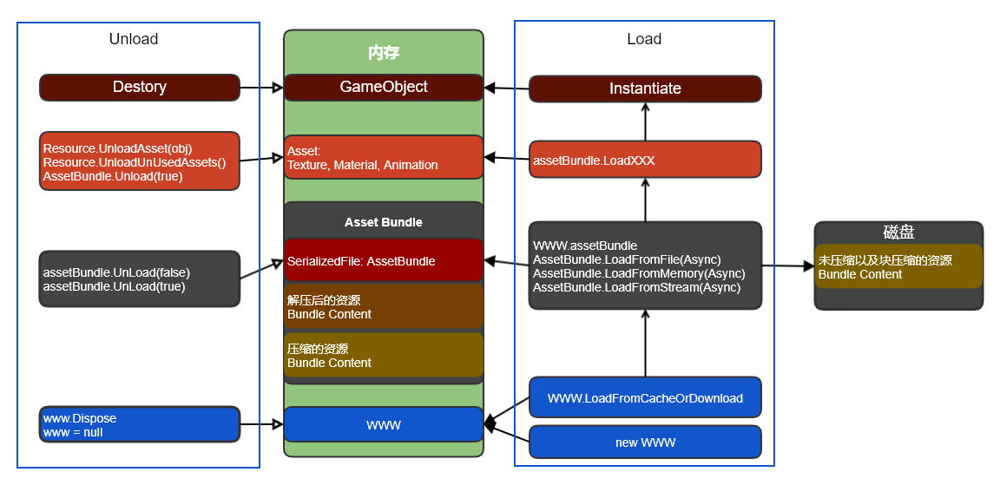

# AssetBundle 文件结构
## 基本介绍
### The AssetBundle File
AssetBundle File 是一个包含多个文件的 **Archive** , 其结构会有一些小的变化取决于是 normal AssetBundle 还是 Scene AssetBundle

Normal AssetBundle


Scene AssetBundle

　场景包还包含了预加载数据（PreloadData）、共享数据（shaderData）和全局光照数据（Global Illumination Data）并且针对场景及其内容的 Stream Loading 进行了优化

### The Manifest File
对于每个生成的 AssetBundle 都会有对应的 Manifest Bundle 生成。 文件内容以文本格式存储，可被任何文本编辑器打开。  
Manifest文件仅用于检查增量构建，运行时不需要。因此不需要打包进正式发行的游戏中。
每个AssetBundle都有一个manifest文件，包含如下信息：
- CRC（循环冗余码）：资源文件的哈希码，在该AssetBundle中的所有资源有一个单一的哈希码，用于检查增量的构建。
- Type tree哈希码：在该AssetBundle中所有类型有一个单一的哈希码，用于检查增量的构建。
- Class types：该AssetBundle中所有的类类型。当为type tree做增量构建检查时将产生一个新的哈希码。
- Assets：该AssetBundle中所有明确包含的资源名字，依赖于该AssetBundle的其他AssetBundle。
- Dependencies： 依赖列表

文件内容大体如下所示

```
ManifestFileVersion: 0
CRC: 2422268106
Hashes:
  AssetFileHash:
    serializedVersion: 2
    Hash: 8b6db55a2344f068cf8a9be0a662ba15
  TypeTreeHash:
    serializedVersion: 2
    Hash: 37ad974993dbaa77485dd2a0c38f347a
HashAppended: 0
ClassTypes:
- Class: 91
  Script: {instanceID: 0}
Assets:
  Asset_0: Assets/Mecanim/StateMachine.controller
Dependencies: {}
```

## 文件结构分析
把压缩数据解开后，就和非压缩模式没有差别，下面只讨论非压缩格式:

AssetBundle由两部分组成：Header 和 DataSegment
- Header 中保存了版本号，数据类型，文件信息，等描述信息。其中文件信息记录了单个资源文件的描述信息以及文件的 offset 和 size。
文件信息记录了数据部分里面的所有单个资源的文件名以及在整个AssetBundle中  
文件offset和size,通过这个信息可以直接获取到AssetBundle中的某一个文件的数据。  
- DataSegment 保存着实际的 Asset 文件内容

文件头结构如下图：


具体的序列化结构如下：
``` csharp
//这里，所有的 int 都是以小端编码的 4 字节整数（不同于外部文件格式采用的大端编码）

// AssetBundle文件头结构
struct AssetBundleFileHead {
     struct LevelInfo {
         unsigned int PackSize;
         unsigned int UncompressedSize;
     };
 
     string FileID;
     unsigned int Version; // bundle格式版本 3.5~4.x : Version == 3
     string MainVersion; // 
     string BuildVersion;
     size_t MinimumStreamedBytes;
     size_t HeaderSize;
     size_t NumberOfLevelsToDownloadBeforeStreaming;
     size_t LevelCount;
     LevelInfo LevelList[];
     size_t CompleteFileSize;
     size_t FileInfoHeaderSize;
     bool Compressed;
};

struct AssetFileHeader {
     struct AssetFileInfo {
          string name;
          size_t offset; //表示的是除去 HeaderSize 后的偏移量
          size_t length;
     };
     size_t FileCount; // 大多数情况只有一个
     AssetFileInfo     File[];
};

struct AssetHeader {
    // TypeTree 是对数据结构本身的描述，通过这个描述，就可以反序列化出每个对象
    //这个 TypeTree 对于 asset bundle 来说是可选的，因为数据结构的信息可以事先放置在引擎中（引擎多半只支持固有的数据类型）。在发布到移动设备上时，TypeTree 是不打包到 asset bundle 中的。
     size_t TypeTreeSize; // TypeTree 部分的大小
     size_t FileSize;
     unsigned int Format;
     size_t dataOffset;
     size_t Unknown;
};

struct ObjectHeader {
     struct ObjectInfo {
          int pathID; // 每个对象都有唯一的字符串 path ，但是在 asset bundle 里并没有直接保存字符串，而是一个 hash 过的整数
          int offset; // 相对当前 asset 块的
          int length;
          byte classID[8]; // Class ID的和具体类型的对应关系，在 Unity3d 的官方文档 可以查到。
     };
     int ObjectCount;
     ObjectInfo Object[];
};

struct AssetTable {
     struct AssetRef {
          byte GUID[8];
          int type;
          string filePath;
          string assetPath;
     };
     int Count;
     byte Unknown;
    vector Refs;
```

## 压缩方案
AssetBundle 压缩后的大致文件组成：


Unity 在打包 AssetBundle 时会默认以 LZMA 格式进行压缩，可以通过 **BuildAssetBundleOptions** 调整压缩方案。  
- BuildAssetBundleOptions.None(LZMA):  
此选项会使用 LZMA 格式压缩成序列化文件流。LZMA 的优点是打包体积小，缺点是使用时需要整体解包，导致加载时间长。
- BuildAssetBundleOptions.UncompressedAssetBundle  
此选项不会对文件进行压缩，优点是加载不需要解包速度快，缺点是打包体积大。
- BueldAssetBundleOptions.ChunkBasedCompression(LZ4)  
此选项会以 LZ4 的格式进行压缩，LZ4 是一种基于 chunk 的算法，该算法运行 Bundle 进行分块（chunk）式加载，只解压缩单个需要使用的资产。

# AssetBundle 加载时的存储方案
Bundle 加载后，分为两部分存储，
- 一部分是头文件，以 SerializedFile 格式存储在内存中，
- 另一部分则是 AssetBundle Content ，依据不同的加载的方式存储在内存或者磁盘中。

## 不同压缩方案的加载 API 对比：

|API|UnCompressed|LZ4(ChunkBasedCompression)|LZMA(Stream Compression)|
|---|---|---|---|
|www | 内存：未压缩，内存读取| 内存：LZ4HC压缩，内存读取| 内存：LZ4压缩，内存读取|
|LoadFromCacheOrDownload| 内存：无，硬盘直读 | 内存：无，硬盘直读| 内存：无，硬盘直读|
|LoadFromMemory(Async)| 内存：未压缩| 内存：LZ4HC压缩 | 内存：LZ4压缩，LZMA解压 -> LZ4压缩|
|LoadFromFile(Async)| 内存：无，硬盘直读 | 内存：无，硬盘直读 | 内存：LZ4压缩 ，硬盘读取 -> LZMA解压 -> LZ4压缩 -> 内存读取|
| WebRequest|  内存：无，Cache直读 | 内存：无，Cache直读 | 内存：无，LZMA解压 -> LZ4压缩|

# AsetBundle 加载后的内存分析


## SerializedFile 分析
> 分别制作干净的 AssetBundle 包，加载进内存，通过 Profile 抓取内存分析大小并对比。Unity 版本 2017.4.x

### Texture 
纹理大小不一样  

|AssetBundle|TextureSize| AssetBundleSize|SerializedFileSize|
|---|---|---|---|
|texture1|512 x 512| 176 KB |18.0 KB |
|texture2|1024 x 1024| 688 KB |18.0 KB |

### Shader 
以拷贝出来的的 Standard Shader 为标准，分别增加其 Properties 和 SubShader  

|AssetBundle|ShaderInfo| AssetBundleSize|SerializedFileSize|
|---|---|---|---|
|shader1|Copy From Standard| 110 KB | **121.6 KB** |
|shader2|+ 40 Properties| 113 KB| **121.6 KB** |
|shader3|+ 20 SubShader| 519 KB |**121.6 KB** |

### Mesh 
顶点数量不同  

|AssetBundle| MeshInfo |AssetBundleSize|SerializedFileSize|
|---|---|---|---|
|mesh1| 0 verts 0 tris |9 KB| **23.2 KB** |
|mesh2| 30000 verts 10000 tris| 419 KB| **23.2 KB** |

Asset 打包进行 AssetBundle 的序列化文件，并不受资源内容尺寸影响，只与资源类型相关

### 复数资源的打包
|AssetBundle| Group |AssetBundleSize|SerializedFileSize|
|---|---|---|---|
|group1 |Texture1 + Mesh1 + Shader1 |289 KB| **129.4 KB** |
|group2 |Texture1 + Texture2 + Mesh1 + Mesh2 + Shader1 + Shader2 |1461 KB| **129.5 KB** |

- 同类资源打包, 并不等于单个资源序列化后的文件之和，而是小于，推测有过一些压缩的方案。
- 重复资源打包，增长量为 0.1KB , 推断同类型资源不会重复创建序列化文件， 增长的 0.1KB 应该是引用相关的数据

---
### Prefab 序列化尺寸 
空 Prefab  
复数空 Prefab 尺寸  

|AssetBundle| Info |AssetBundleSize|SerializedFileSize|
|---|---|---|---|
| prefab1| 空的 Gameobject | 5 KB | **18.3 KB** |
| prefabgroup | 100 个 空 Gameobject | 30 KB | **23 KB** |
100 个 Prefab 打包相比单个 Prefab ，增长量为 1.7 KB , 复数的 Prefab 合并打包不会创建重复的序列化文件

### Prefab 复杂化后的尺寸
|AssetBundle| Info |AssetBundleSize|SerializedFileSize|
|---|---|---|---|
| prefab1| 空的 Gameobject | 5 KB | **18.3 KB** |
| prefab2| 深度创建 1000 个 Child | 192 KB | **65.2 KB** |
| prefab3| 广度创建 1000 个 Child | 197 KB | **67.0 KB** |

1000 个 Gameobject 嵌套创建后相比空的 GameObject ，增长量为 46.9 KB ，广度嵌套相比增长再多 1.8 KB 。 对比上一个空 prefab 的测试， 100 个 prefab 增长约 5KB , 这里 1000 个 child 对应增长  46.9 KB 。Prefab 的复杂度增加也会增大序列化文件的尺寸

## MonoScript AssetBundle 序列化尺寸
|AssetBundle| Info |AssetBundleSize|SerializedFileSize|
|---|---|---|---|
| mono1 | 干净的 MonoScript | 6 KB | **20.1 KB** |
| mono2 | + 10 Vector3[] 序列化字段 | 7 KB | **20.8 KB** |
| mono3 | 每个序列化字段填入100个 vector3 | 19 KB | **20.8 KB** |
脚本的序列化只与序列化字段的的数量有关，字段内容并不被提前序列化后加载

## AssetBundle 中依赖关系的序列化分析
|AssetBundle| Info |AssetBundleSize|SerializedFileSize|
|---|---|---|---|
| reference1 | GameObject + Mono | 6 KB | **20.2 KB** |
| reference2 | GameObject + Mono + Texture | 178 KB | **21.6 KB** |
| reference3 | GameObject + Mono -> Texture | 178 KB | **21.6 KB** |
| reference4 | GameObject + Mono -> Texture(texture1) | 6 KB | **92.3 KB** |
| reference4 | GameObject + Mono -> Texture1(texture1) Texture2(texture2) | 6 KB | **92.4 KB** |

- 包内依赖与包内引用没有大小的变化，推断引用关系不会被序列化或者是量级太小无法感知
- 包之间的引用产生了一个 70.7 KB 的变化，这个变化不会随着包的引用数量而增加

网络上查了以下资料， Unity 在 Unit2018 大会上对 SerializedFile 文件大小有过讲解，细节如下：

> 其实SerializedFile记录着重建资源所需的信息。而其大体的组成是有2 x 7KB的文件读取Buffer，较大的TypeTree占用，如果存有外部引用，会有一个最少72KB的External References的Buffer，剩下的就是我们资源的数据了，我们会在后续版本把External References的内存占用降到4KB+
>
>Profiler 内 SerializedFile 大体组成 (Unity 2017.4.1f Mobile & Editor)
> - 14Kb File Read Cache
> - (较大) TypeTree
> - 72KB External References
> - (较小，与 AB 内 Object 数量相关) Object Map & Infos  
>
>[原文地址](https://connect.unity.com/p/unite-2018-jie-xi-assetbundle)  

# 总结
- 除了为了极短的减少包体尺寸 LZ4 的压缩格式在内存的额外占用，包体的大小，加载的时间上都有一定的优化能力，是一个不错的选择方案。
- 从 SerializedFile 文件大小的分析可知，在分包策略上需要更多的考虑合包的可能性，否则容易造成复数的 External Refernce Buff 区域创建，造成内存的浪费。


### 参考：
[Unity3D asset bundle 格式简析](https://blog.codingnow.com/2014/08/unity3d_asset_bundle.html)  
[ClassIDReference](https://docs.unity3d.com/Manual/ClassIDReference.html)  
[Unite 2018 | 解析AssetBundle](https://connect.unity.com/p/unite-2018-jie-xi-assetbundle)  
[AssetBundle文件结构浅析](https://www.cnblogs.com/pinkfloyd/p/6489979.html)