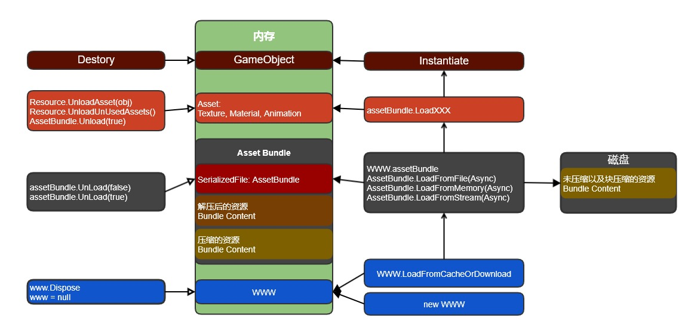

# AssetBundle 加载流程
加载流程可归纳为以下两种
- 从目标路径读取并创建 AssetBundle 对象 
  > 目标可存在远端服务器，也可是本地磁盘
- 从 AssetBundle 对象中创建 Asset

## 加载 AssetBundle 对象的几种方式与区别
说到加载，必须了解 AssetBundle 在运行时的存储方案。 Bundle 分为两部分存储，一部分是包含 Bundle 概览的头文件，以 SerializedFile 格式存储在内存中，另一部分则是 Bundle Content ，会更根据加载的方式以流的方式存储在内存或者磁盘中。

根据文档 AssetBundle 的加载有以下几种方式
### wwww.assetBundle
- 通过 www 对象加载 url 地址所在的 ab 包，此方法会在内存中创建一块 webstream 用于保存 bundle
- www.LoadFromCacheOrDownload 加载 bundle 文件并将 bundle 内容以解压的格式存入磁盘作为缓存,后续的 Load 通过 IO 从磁盘读取。

### AssetBundle.LoadFromFile(Async)
从磁盘路径读取 AssetBundle 文件，如果文件内容是以 LZMA 格式压缩的，则会将内容解压进内存保存。未压缩(uncompressed) 和块压缩(chunk-compressed) 的部分将会通过 IO 从磁盘读取。

LZMA 格式加载后内存增长 4.4MB

LZ4 格式加载后内存增长 0.5MB

NO COMPRESSION 加载后内存增长 0.1MB

### AssetBundle.LoadFromMemory(Async)
从内存的 byets 数据中创建 bundle 内容， 适用于需要对原始数据进行解密的方式。

### AssetBundle.LoadFromStream(Async)
与 LoadFromFile 类似， LZMA 格式压缩的会被解压进内存，未压缩(uncompressed) 和块压缩(chunk-compressed) 的部分将会直接通过 Stream 来读取

## 加载 Assets
获得到 AssetBundle 对象后，即可通过 bundle 对象 load 相关 Asset。加载完成的 Asset 会进入内存中，实例化需要单独进行.

# AssetBundle 的卸载

## 内存分析

根据上图可详细的获取到，卸载各区域内存的方法。合理应用卸载和加载管理好游戏运行时的内存。

# 小结
压缩虽然能减少 AB 包体的大小，但是在运行时会分配内存保存解压后的 Bundle 内容。在实际项目中，需要合理的根据情况权衡打包的方案。